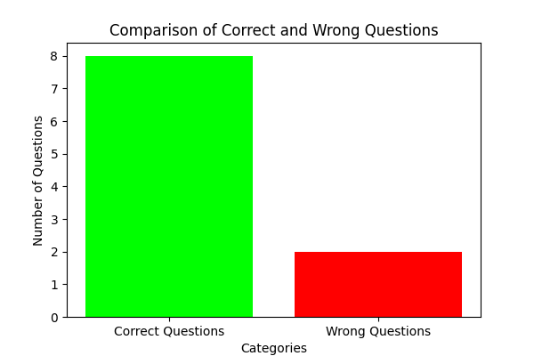

# Results
Below are the results and the insight obtained from the APIs

## Quiz API
The test was of 128 mins which consist of 128 Questions of Topic `structural organisation in animals` whose topic_id is `146` and the level of the questions are not defined.

The marking of the questions are +4 for correct answer and -1 for each wrong answer.

In this test the number of questions where options 1 is correct is 16 and 38, 32, 42 respectively for options 2, 3 and 4.

## Response API
Since most of the data was given in API only like Accuracy, Correct question etc. So here I spent some time in getting the details of the question and things related to those questions.

The distriution of Correct and Incorrect number of questions for the latest test is below

The distribution of the questions which are correct and incorrect acorss the topics and difficulty level and be understood by the below graph
